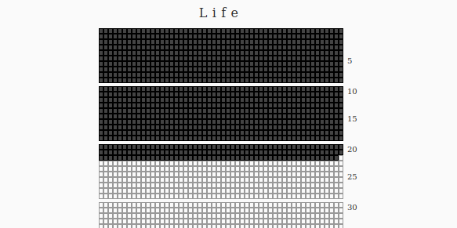

# mori

Visualizes how many weeks you have lived given your date of birth. Just a
single web page, modify the date of birth found in the source to your own.
Since a year is not exactly 52 weeks, every filled row will not coincide
with your birthday, but instead with a certain number of extra weeks. Still
the goal is to make you aware of your mortality, and it fulfills that
purpose.

